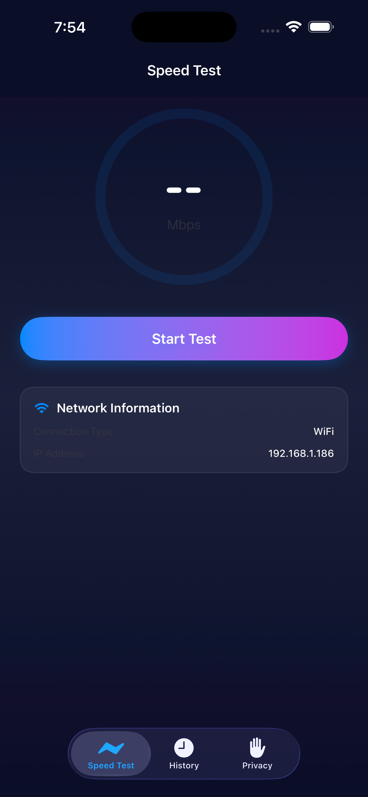

# Speed Test Stealth

A precise, no-nonsense iOS network speed test. Measures download, upload, latency, and jitter against Cloudflare's global edge — the same measurement methodology as the Cloudflare Speed Test web app, ported natively to SwiftUI.

[](https://apps.apple.com/app/id6772637733)
[](https://www.apple.com/ios/)
[](https://swift.org)
[](https://developer.apple.com/xcode/)
[](https://developer.apple.com/xcode/swiftui/)
[](https://developer.apple.com/xcode/swiftdata/)
[](https://fastlane.tools)
[](LICENSE)

[](https://apps.apple.com/app/id6772637733)

<p align="center">
  
</p>

## What it measures

- **Download & Upload** — 14 progressive stages (100 KB → 250 MB) so accuracy scales with your connection
- **Ping** — unloaded round-trip latency to Cloudflare's edge
- **Jitter** — consistency of latency over time
- **Loaded latency & jitter** — bufferbloat indicators measured during transfer
- **Packet loss** — observed during the test window
- **Network context** — Wi-Fi / cellular type, carrier, public IP, ISP, and geolocation

Results are reported as 90th-percentile values, filtering one-off spikes for a stable representative number.

## How it was built

| Layer | Choice |
|---|---|
| UI | SwiftUI (iOS 18+) |
| State | Swift Concurrency (`actor`) + `@Observable` view models |
| Persistence | SwiftData (`@Model SpeedTestResult`) for run history |
| Networking | `URLSession` streaming uploads/downloads against Cloudflare's `speed.cloudflare.com` endpoints |
| Geolocation | Cloudflare trace + IP geolocation lookup |
| Project gen | [XcodeGen](https://github.com/yonaskolb/XcodeGen) (`project.yml` is the source of truth) |
| Release | [fastlane](https://fastlane.tools) lanes for `prepare` / `beta` / `release` via App Store Connect API |
| Privacy | `PrivacyInfo.xcprivacy` declared; no third-party SDKs, no analytics, no ad tracking |

### Architecture

```
SpeedTest/
├── SpeedTestApp.swift          # @main, attaches SwiftData container
├── Models/
│   └── SpeedTestResult.swift   # @Model — persisted run record
├── Services/
│   ├── SpeedTestEngine.swift   # actor — runs measurement phases
│   ├── NetworkInfo.swift       # Wi-Fi / cellular / carrier detection
│   └── IPGeolocation.swift     # public IP + ISP lookup
├── ViewModels/
│   └── SpeedTestViewModel.swift
└── Views/
    ├── ContentView.swift
    ├── SpeedTest/              # live-test UI
    ├── History/                # SwiftData-backed history
    └── PrivacyPolicyView.swift
```

The `SpeedTestEngine` actor drives a phase machine (`idle → latency → download → upload → finished`) and publishes `Progress` snapshots that the view model surfaces to SwiftUI. All transfers are real network I/O against Cloudflare — no mock data, no synthetic timing.

## Getting started

Prerequisites: Xcode 26+, Ruby with Bundler, [XcodeGen](https://github.com/yonaskolb/XcodeGen) (`brew install xcodegen`).

```sh
bundle install
xcodegen generate
open SpeedTest.xcodeproj
```

Run on a real device for accurate cellular measurements — the Simulator only sees the host's Wi-Fi.

## Deployment

Release tooling lives in `fastlane/`. Full details in [`DEPLOYMENT.md`](DEPLOYMENT.md).

```sh
bundle exec fastlane ios prepare   # regen project + signing-disabled Release build
bundle exec fastlane ios beta      # TestFlight
bundle exec fastlane ios release   # App Store submission
```

App Store Connect credentials are supplied via the `APP_STORE_CONNECT_API_KEY_*` environment variables.

## Privacy

See [`PRIVACY.md`](PRIVACY.md). The app performs network measurements and an IP-based geolocation lookup to label results — nothing is sent to a backend operated by us, there is no account, and no analytics or ad SDKs are linked.

## Support

See [`SUPPORT.md`](SUPPORT.md).

## Repository

Source: [github.com/harborline/ios-speedtest](https://github.com/harborline/ios-speedtest)
